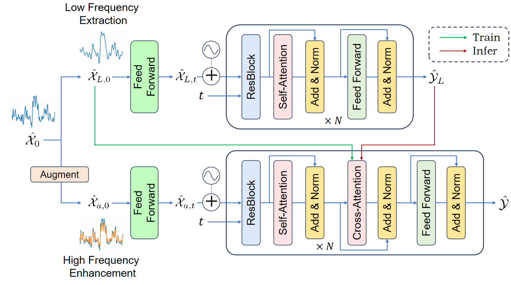

## Introduction

# FDEDiff: Frequency Decomposed and Enhanced Diffusion for Time Series Generation

**FDEDiff** is a multi-stage diffusion framework for generating realistic and diverse synthetic time series data. It addresses key challenges in modeling complex temporal patterns by decomposing input sequences into low- and high-frequency components.

- **Stage 1**: Learns coarse, periodic structures from low-frequency signals using an unconditional diffusion model.
- **Stage 2**: Enhances high-frequency details to recover fine-grained temporal variations.

This frequency-aware design enables FDEDiff to capture multi-resolution characteristics of time series, resulting in improved quality, diversity, and domain adaptability. It is especially effective for data augmentation in privacy-sensitive applications across domains like finance, healthcare, and energy.

**Key Features:**
- Multi-resolution diffusion modeling
- High-frequency enhancement mechanism
- Superior performance over state-of-the-art generative models
- Supports diverse real-world time series datasets

Explore the code and get started with generating high-quality synthetic time series data using FDEDiff!

<p align="center">
    
</p>

## 📚 【TODO】Dataset Preparation
All the mentioned real-world datasets (Stocks, ETTh1, fMRI, Electricity) can be obtained from Google Drive. Please download dataset.zip, then unzip and copy it to the folder ./data in our repository.

## 🚀 Getting Started

### Installation

1. Install Python 3.10+, and then install the dependencies:

```shell
pip install -r requirements.txt
```

### 📈 Example Command
Through `main.py`, you can conveniently perform training, generation, and evaluation based on the configuration file. Moreover, if you wish to conduct generation or evaluation separately, you only need to use the configuration file from the trained model folder, where the required parameters `lf_path` and `hf_path` have already been automatically saved during the training process.

```shell
python main.py \
    --config 'path of your config file' 
```

## Acknowledgement

We appreciate the following GitHub repos a lot for their valuable code and efforts.

- TimeGAN [\[repo\]](https://github.com/jsyoon0823/TimeGAN)
- TimeVAE [\[repo\]](https://github.com/abudesai/timeVAE)
- DiffusionTS [\[repo\]](https://github.com/Y-debug-sys/Diffusion-TS)
